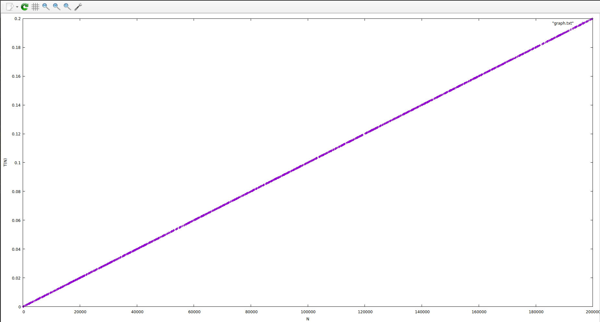

#  Политика генерации данных
 

>При генерации тестов, генерируется случайное число n, а номера столовых генерируются не от [0, 2*(10^5)], а также до n, чтобы шансы на появление повторяющихся чисел были выше.

#   График зависимости времени работы программы, от N

